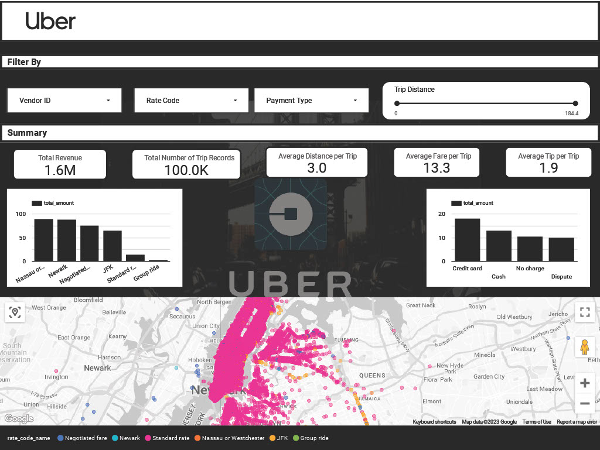

# Uber Data Pipeline and Analytics Dashboard

## Introduction

The goal of this project is to create a **Data Engineering Pipeline** and a **Data Analytics Dashboard** on Uber Trip data using Google Cloud Platform Mage AI Tool, and Looker Studio.

## Architecture 

## Mage.AI Data Pipeline Design

  

 

## Technology Used
Programming Languages Used - Python, SQL

Google Cloud Platform
- Google Bucket Storage
- Compute Engine Instance (for Mage AI deployment)
- BigQuery (Creating and Joining Tables for Analytics) 
- Looker Studio (Analytics Dashboard)

Modern Data Pipeine Tool - https://www.mage.ai/

Contibute to this open source project - https://github.com/mage-ai/mage-ai

## Dataset Used
TLC Trip Record Data
Yellow and green taxi trip records include fields capturing pick-up and drop-off dates/times, pick-up and drop-off locations, trip distances, itemized fares, rate types, payment types, and driver-reported passenger counts. 

Please check the data foler for the dataset used for this project

More info about dataset can be found here:
1. Website - https://www.nyc.gov/site/tlc/about/tlc-trip-record-data.page
2. Data Dictionary - https://www.nyc.gov/assets/tlc/downloads/pdf/data_dictionary_trip_records_yellow.pdf

## Data Model

### Looker Data Analytics Dashboard
The Looker Data Analytics Dashboard created looks like the below:

  

 

The complete Data Analytics Dashboard can be viewed here: [Looker Dashboard](https://lookerstudio.google.com/s/uEpz2rxmc7I)

